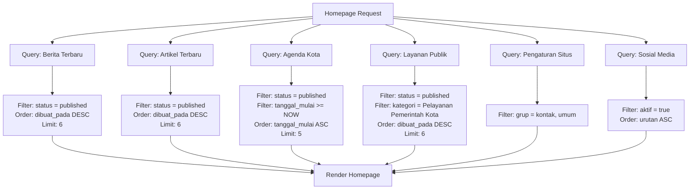
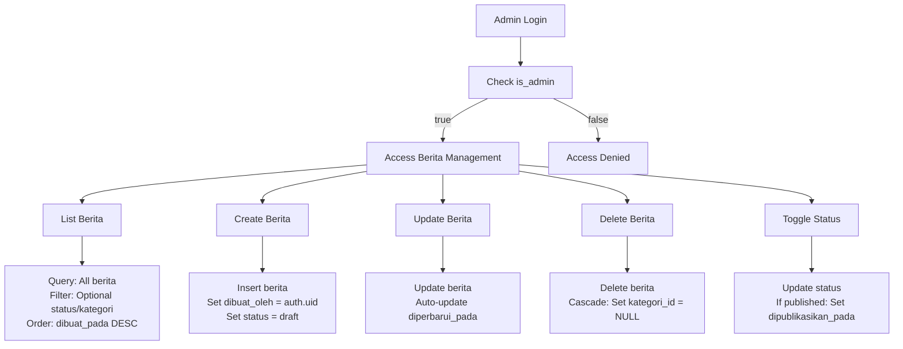
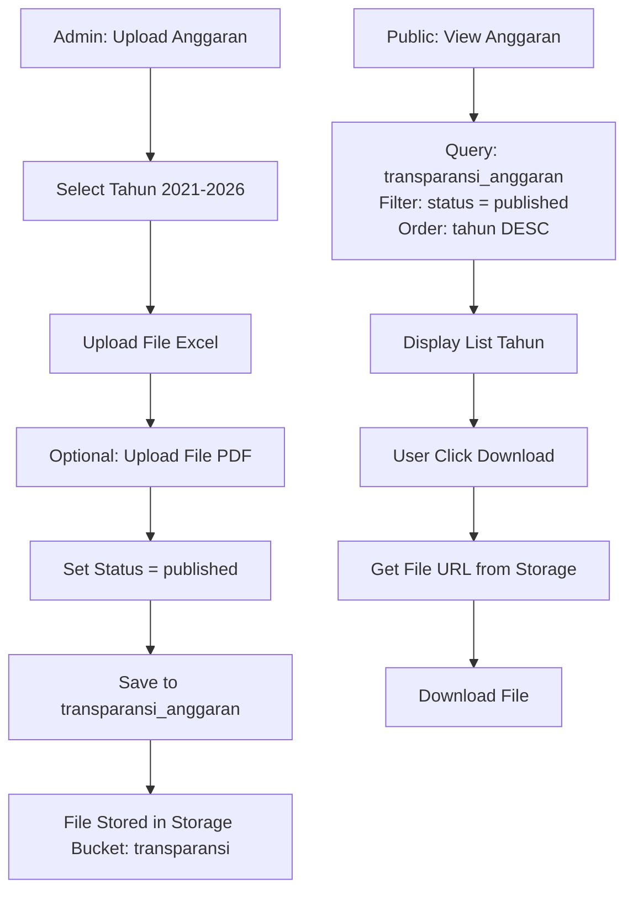
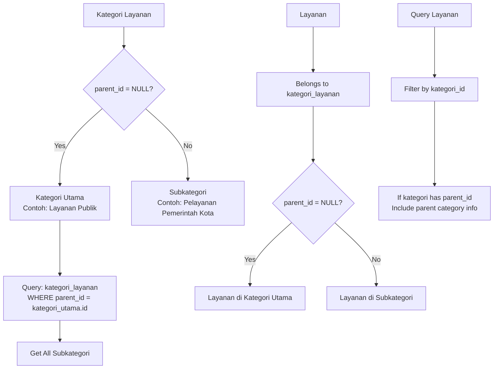
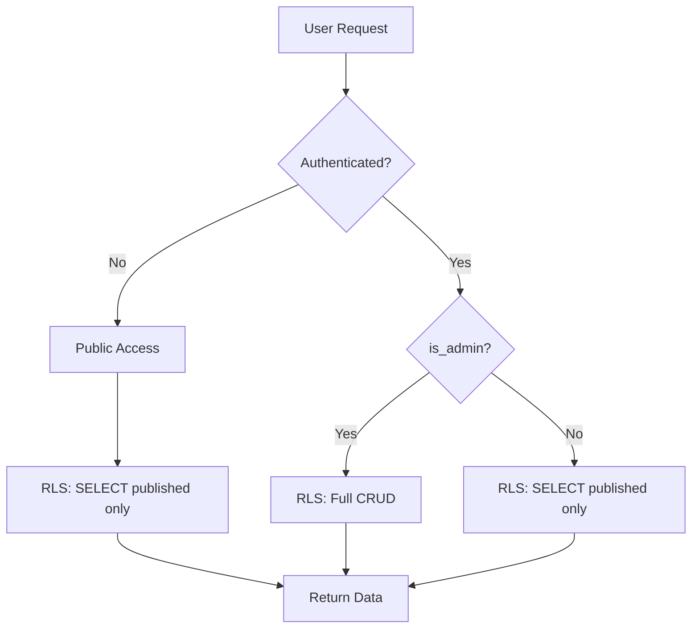
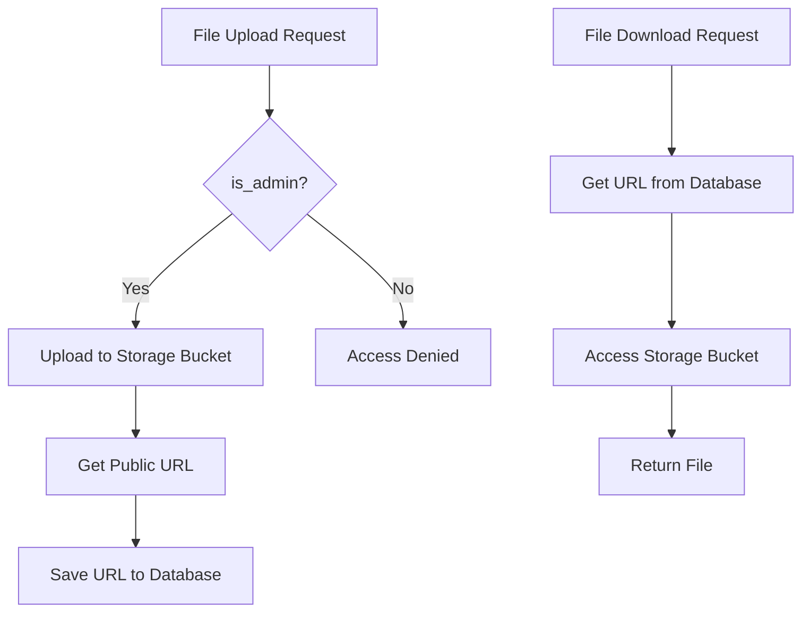

# Diagram Relasi Database CMS Pemerintah Kota

## Entity Relationship Diagram

```mermaid
erDiagram
    
    kategori_berita ||--o{ berita : "kategori_id"
    kategori_artikel ||--o{ artikel : "kategori_id"
    kategori_layanan ||--o{ layanan : "kategori_id"
    kategori_layanan ||--o| kategori_layanan : "parent_id"
    kategori_wisata ||--o{ wisata : "kategori_id"
    
    admin_pengguna {
        uuid id PK
        text email UK
        text peran
        text nama_lengkap
        boolean aktif
        timestamp dibuat_pada
        timestamp diperbarui_pada
    }
    
    kategori_berita {
        uuid id PK
        text nama
        text slug UK
        text deskripsi
        integer urutan
        timestamp dibuat_pada
    }
    
    berita {
        uuid id PK
        text judul
        text slug UK
        text konten
        text thumbnail_url
        uuid kategori_id FK
        text status
        text meta_description
        text meta_keywords
        integer dilihat
        timestamp dibuat_pada
        timestamp diperbarui_pada
        timestamp dipublikasikan_pada
    }
    
    kategori_artikel {
        uuid id PK
        text nama
        text slug UK
        text deskripsi
        integer urutan
        timestamp dibuat_pada
    }
    
    artikel {
        uuid id PK
        text judul
        text slug UK
        text konten
        text thumbnail_url
        uuid kategori_id FK
        text status
        text meta_description
        text meta_keywords
        integer dilihat
        timestamp dibuat_pada
        timestamp diperbarui_pada
        timestamp dipublikasikan_pada
    }
    
    agenda_kota {
        uuid id PK
        text judul
        text deskripsi
        timestamp tanggal_mulai
        timestamp tanggal_selesai
        text lokasi
        text status
        timestamp dibuat_pada
        timestamp diperbarui_pada
    }
    
    kategori_layanan {
        uuid id PK
        text nama
        text slug UK
        text deskripsi
        uuid parent_id FK
        integer urutan
        text icon_url
        timestamp dibuat_pada
    }
    
    layanan {
        uuid id PK
        text judul
        text slug UK
        text konten
        text icon_url
        uuid kategori_id FK
        text status
        text meta_description
        integer dilihat
        timestamp dibuat_pada
        timestamp diperbarui_pada
    }
    
    perangkat_daerah {
        uuid id PK
        text nama_perangkat
        text slug UK
        text jabatan_kepala
        text nama_kepala
        text foto_url
        text kontak
        text alamat
        text deskripsi
        integer urutan
        boolean aktif
        timestamp dibuat_pada
        timestamp diperbarui_pada
    }
    
    transparansi_anggaran {
        uuid id PK
        integer tahun UK
        text file_excel_url
        text file_pdf_url
        text deskripsi
        text status
        timestamp dibuat_pada
        timestamp diperbarui_pada
    }
    
    halaman {
        uuid id PK
        text slug UK
        text judul
        text konten
        text meta_description
        text meta_keywords
        timestamp dibuat_pada
        timestamp diperbarui_pada
    }
    
    kategori_wisata {
        uuid id PK
        text nama
        text slug UK
        text deskripsi
        integer urutan
        timestamp dibuat_pada
    }
    
    wisata {
        uuid id PK
        text nama
        text slug UK
        text deskripsi
        text konten
        text gambar_url
        uuid kategori_id FK
        text alamat
        decimal koordinat_lat
        decimal koordinat_lng
        text status
        text meta_description
        integer dilihat
        timestamp dibuat_pada
        timestamp diperbarui_pada
    }
    
    video {
        uuid id PK
        text judul
        text slug UK
        text deskripsi
        text url_video
        text thumbnail_url
        integer durasi
        text status
        integer dilihat
        timestamp dibuat_pada
        timestamp diperbarui_pada
    }
    
    pengumuman {
        uuid id PK
        text judul
        text slug UK
        text konten
        text file_lampiran_url
        text status
        date tanggal_berlaku_mulai
        date tanggal_berlaku_selesai
        timestamp dibuat_pada
        timestamp diperbarui_pada
        timestamp dipublikasikan_pada
    }
    
    sosial_media {
        uuid id PK
        text platform UK
        text url
        text ikon_url
        boolean aktif
        integer urutan
        timestamp dibuat_pada
        timestamp diperbarui_pada
    }
    
    pengaturan_situs {
        uuid id PK
        text kunci UK
        text nilai
        text tipe
        text deskripsi
        text grup
        integer urutan
        timestamp dibuat_pada
        timestamp diperbarui_pada
    }
```



## Alur Data untuk Fitur Utama

### 1. Homepage Public



### 2. Manajemen Berita (Admin)



### 3. Transparansi Anggaran



### 4. Hierarki Kategori Layanan



## Query Patterns yang Sering Digunakan

### 1. Latest Published Berita (Homepage)
```sql
SELECT 
  b.*,
  kb.nama as kategori_nama,
  kb.slug as kategori_slug
FROM berita b
LEFT JOIN kategori_berita kb ON b.kategori_id = kb.id
WHERE b.status = 'published'
ORDER BY b.dipublikasikan_pada DESC
LIMIT 6;
```

### 2. Search Berita dengan Full-Text
```sql
SELECT 
  b.*,
  kb.nama as kategori_nama
FROM berita b
LEFT JOIN kategori_berita kb ON b.kategori_id = kb.id
WHERE b.status = 'published'
  AND b.judul ILIKE '%keyword%'
ORDER BY b.dipublikasikan_pada DESC;
```

### 3. Agenda Kota Mendatang
```sql
SELECT *
FROM agenda_kota
WHERE status = 'published'
  AND tanggal_mulai >= NOW()
ORDER BY tanggal_mulai ASC
LIMIT 5;
```

### 4. Layanan dengan Hierarki Kategori
```sql
WITH RECURSIVE kategori_tree AS (
  -- Base case: kategori utama
  SELECT id, nama, slug, parent_id, 0 as level
  FROM kategori_layanan
  WHERE parent_id IS NULL
  
  UNION ALL
  
  -- Recursive case: subkategori
  SELECT kl.id, kl.nama, kl.slug, kl.parent_id, kt.level + 1
  FROM kategori_layanan kl
  INNER JOIN kategori_tree kt ON kl.parent_id = kt.id
)
SELECT 
  l.*,
  kt.nama as kategori_nama,
  kt.level as kategori_level
FROM layanan l
INNER JOIN kategori_tree kt ON l.kategori_id = kt.id
WHERE l.status = 'published'
ORDER BY l.dibuat_pada DESC;
```

### 5. Transparansi Anggaran (Public)
```sql
SELECT 
  tahun,
  file_excel_url,
  file_pdf_url,
  deskripsi
FROM transparansi_anggaran
WHERE status = 'published'
ORDER BY tahun DESC;
```

### 6. Perangkat Daerah Aktif
```sql
SELECT *
FROM perangkat_daerah
WHERE aktif = true
ORDER BY urutan ASC, nama_perangkat ASC;
```

### 7. Pengaturan Situs untuk Footer
```sql
SELECT kunci, nilai, tipe
FROM pengaturan_situs
WHERE grup IN ('kontak', 'umum')
ORDER BY grup, urutan;
```

### 8. Sosial Media Aktif
```sql
SELECT platform, url, ikon_url
FROM sosial_media
WHERE aktif = true
ORDER BY urutan ASC;
```

## Index Usage Strategy

### Indexes untuk Query Optimization

1. **Berita Latest**: `idx_berita_status_dibuat_pada` (composite)
2. **Berita by Slug**: `idx_berita_slug` (unique)
3. **Agenda Mendatang**: `idx_agenda_kota_tanggal_status` (composite)
4. **Layanan by Category**: `idx_layanan_kategori_id` + `idx_kategori_layanan_parent_id`
5. **Search**: `idx_berita_judul_trgm` (GIN index untuk full-text)

## RLS Policy Flow



## Storage Access Flow



